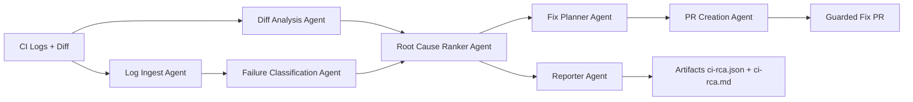

# ci-rootcause

Deterministic CI root-cause analysis for failed CI runs.


## Proven Results (MVP Suite)

From the curated MVP benchmark (`13` cases):
- Classification accuracy: `100%` (`13/13`)
- Baseline classification accuracy: `69.23%` (`9/13`)
- Improvement: `+30.77` percentage points (about `44.4%` relative lift vs baseline)
- Top-1 root-cause accuracy: `100%` (`12/12` applicable cases)
- Agentic proposal validity: `100%` (`6/6` exercised cases)
- Guarded validation pass rate: `50%` (`3/6`, three good fixes passed and three bad fixes were blocked)
- Artifact hash reproducibility: `100%`
- Confidence reproducibility: `100%`

What has been tested so far:
- Automated test suite: `297` tests passing, `1` opt-in live GitHub test skipped by default.
- Benchmark failure classes: `TYPECHECK`, `LINT`, `TEST`, `DEPENDENCY`, and `INFRA`.
- Agentic benchmark coverage: `6` proposal cases across lint, test, and typecheck fixes.
- Guardrail coverage: safe default comment-only mode, PR opt-in gate, confidence threshold, scoped file changes, validation pass/fail, missing hosted API key, and malformed agentic proposal retry.
- Live GitHub App smoke coverage: real `workflow_run` webhooks, PR comment create/update, typecheck/dependency/infra failures, local/Ollama suggestions, validation-failed PR gate, async webhook acknowledgement for slow local models, low-signal comment suppression, and a green app-created typecheck fix PR.

## Proven Live GitHub App Flow

Validated with a real GitHub App installation and live `workflow_run` webhooks:

1. A PR introduced a Python typecheck failure.
2. `ci-rootcause` posted a high-confidence RCA comment with file/line evidence.
3. Low-confidence noise from the regular CI workflow was suppressed.
4. The app created a guarded fix PR against the failing PR branch.
5. The fix PR applied a formatted, evidence-backed change and passed `lint-and-test` plus `packaging-smoke`.

The app-created fix changed the failing call from `needs_int("7")` to `needs_int(7)` and remained human-reviewable: no auto-merge, no branch-protection bypass.

Benchmark source:
- Reproduce locally: `python scripts/run_benchmark.py --suite fixtures/benchmarks/mvp-suite.json --output-root artifacts/benchmark-mvp --report-json docs/reports/mvp-benchmark-report.json --report-md docs/reports/mvp-benchmark-report.md`
- Compare local Ollama against the fixture-backed benchmark: `python scripts/run_ollama_comparison.py --suite fixtures/benchmarks/mvp-suite.json --llm-model qwen2.5-coder:7b --report-json artifacts/ollama-comparison/latest.json`
- [`docs/reports/mvp-benchmark-report.md`](docs/reports/mvp-benchmark-report.md)
- [`docs/reports/mvp-benchmark-report.json`](docs/reports/mvp-benchmark-report.json)
- [`docs/reports/ollama-comparison.md`](docs/reports/ollama-comparison.md)
- [`docs/limitations.md`](docs/limitations.md)

## App-First Quickstart (No YAML)

Primary path (recommended):

1. Install the GitHub App for your target repository.
2. Configure app runtime with safe defaults:
   - `enabled=true`
   - `post_comment=true`
   - `enable_pr_mode=false`
   - `create_fix_pr=false`
3. Trigger a failed `workflow_run` and verify:
   - RCA comment appears on PR/commit context
   - `ci-rca.json` and `ci-rca.md` paths are returned
   - Outcome status/reason codes are machine-readable

Setup references:
- [`docs/app-first-mvp.md`](docs/app-first-mvp.md)
- [`docs/app-config-contract.md`](docs/app-config-contract.md)
- [`docs/app-outcome-codes.md`](docs/app-outcome-codes.md)
- [`docs/app-operations.md`](docs/app-operations.md)
- [`docs/migration-action-to-app.md`](docs/migration-action-to-app.md)

Reference artifact examples:
- [`artifacts/benchmark-mvp/case-typecheck-ts2345/ci-rca.json`](artifacts/benchmark-mvp/case-typecheck-ts2345/ci-rca.json)
- [`artifacts/benchmark-mvp/case-typecheck-ts2345/ci-rca.md`](artifacts/benchmark-mvp/case-typecheck-ts2345/ci-rca.md)

## Agentic Modes (Optional)

Recommended default for new users: `deterministic`.

| Mode | Autonomy | Key requirement | Cost profile | Risk profile |
| --- | --- | --- | --- | --- |
| `deterministic` | Rule-based only | None | Lowest | Lowest |
| `agentic_assist` | LLM proposes candidate fix steps, deterministic pipeline validates/falls back | Hosted providers require API key; `local` does not | Medium | Low-medium |
| `agentic_full` | Highest autonomy path (explicit opt-in gate required) | Hosted providers require API key; `local` does not | Highest | Highest |

Provider support:
- Hosted: `openai`, `gemini`, `anthropic` (require `provider_api_key` in agentic modes).
- Local: `local` (Ollama endpoint compatible, no paid vendor API key required).
- Recommended local default: `qwen2.5-coder:3b`; use `qwen2.5-coder:7b` for larger local quality runs.

Provider examples:
- GitHub App local/Ollama: `CI_ROOTCAUSE_APP_LLM_PROVIDER=local` + `CI_ROOTCAUSE_APP_LLM_BASE_URL=http://localhost:11434`
- GitHub App OpenAI: `CI_ROOTCAUSE_APP_LLM_PROVIDER=openai` + `CI_ROOTCAUSE_APP_LLM_API_KEY=<secret>`
- GitHub App Gemini: `CI_ROOTCAUSE_APP_LLM_PROVIDER=gemini` + `CI_ROOTCAUSE_APP_LLM_API_KEY=<secret>`
- GitHub App Anthropic: `CI_ROOTCAUSE_APP_LLM_PROVIDER=anthropic` + `CI_ROOTCAUSE_APP_LLM_API_KEY=<secret>`
- Workflow/action mode uses the same provider names through `provider` and `provider_api_key` inputs.

## Purpose

`ci-rootcause` analyzes CI failures and produces:

- Structured failure graph
- Deterministic root-cause ranking
- Deterministic confidence score
- Evidence-backed fix plan
- Deterministic patch plan operations (`modify/create/delete/rename`)
- Optional guarded fix PR (never auto-merged)
- `ci-rca.json` and `ci-rca.md` artifacts
- `ci-rca-observability.json` run telemetry artifact (trace/timing/failure taxonomy)

Primary runtime target is GitHub Actions.
Provider adapter defaults support GitHub Actions and GitLab CI metadata resolution.

## When To Use ci-rootcause

Ideal use cases:
- CI failed and you need deterministic root-cause ranking with evidence, not just a generic summary.
- You want machine-readable RCA artifacts (`ci-rca.json`) for automation/reporting.
- You want safe, guardrailed fix PR proposals with explicit confidence thresholds.
- You need consistent behavior across repeated runs on the same inputs.

Not a fit (non-goals):
- Running arbitrary autonomous repo-wide refactors.
- Replacing your normal test/lint/build workflows.
- Auto-merging remediation changes without human review.

Comparison with formatter-only autofix workflows:

| Capability | ci-rootcause | Formatter/Linter autofix flow |
| --- | --- | --- |
| Works from failed CI logs + diff | Yes | Usually no |
| Root-cause classification | Yes | No |
| Ranked RCA with confidence | Yes | No |
| Structured RCA artifact (`ci-rca.json`) | Yes | No |
| Guardrailed optional fix PRs | Yes | Yes (tool-dependent) |
| Designed for deterministic replay | Yes | Varies |

## Architecture Overview



## Local Setup

Requirements:

- Python 3.11+

Install tools:

```bash
python -m pip install --upgrade pip
pip install -r requirements.txt
pre-commit install
```

Run checks:

```bash
ruff check .
ruff format --check .
pytest
```

## CLI Quickstart

1. Install dependencies:

```bash
pip install -r requirements.txt
```

2. Run the local pipeline once:

```bash
ci-rootcause \
  --log-path fixtures/ci-logs/github-actions-python-failure.log \
  --diff-path fixtures/diffs/refactor-only.diff \
  --output-dir artifacts \
  --timestamp 2026-02-21T00:00:00Z \
  --commit abc123 \
  --run-id gha_quickstart_1 \
  --base-commit abc122 \
  --head-commit abc123 \
  --repository owner/repo
```

3. Inspect generated artifacts:
- `artifacts/ci-rca.json`
- `artifacts/ci-rca.md`

## Demo Script

Run three reproducible demo scenarios:

```bash
for case in \
  fixtures/demos/01-dependency-lockfile-drift \
  fixtures/demos/02-typecheck-ts2345 \
  fixtures/demos/03-infra-timeout
do
  name="$(basename "$case")"
  ci-rootcause \
    --log-path "$case/ci.log" \
    --diff-path "$case/change.diff" \
    --output-dir "artifacts/demo/$name" \
    --timestamp 2026-02-21T00:00:00Z \
    --commit abc123 \
    --run-id "demo_${name}" \
    --base-commit abc122 \
    --head-commit abc123 \
    --repository owner/repo
done
```

Demo fixture pack:
- [`fixtures/demos/README.md`](fixtures/demos/README.md)
- `fixtures/demos/01-dependency-lockfile-drift`
- `fixtures/demos/02-typecheck-ts2345`
- `fixtures/demos/03-infra-timeout`

## Local CLI Execution

Run end-to-end deterministic analysis locally:

```bash
ci-rootcause \
  --log-path fixtures/ci-logs/github-actions-python-failure.log \
  --diff-path fixtures/diffs/refactor-only.diff \
  --historical-runs-path fixtures/classification/historical-runs.sample.json \
  --output-dir artifacts \
  --timestamp 2026-02-20T00:00:00Z \
  --commit abc123 \
  --run-id gha_local_1 \
  --base-commit abc122 \
  --head-commit abc123 \
  --repository owner/repo
```

CLI behavior:

- Writes `ci-rca.json` and `ci-rca.md` into `--output-dir`
- Prints a machine-readable JSON summary to stdout
- Exits `0` for `completed`/`partial` analysis runs, `2` for runtime/input errors
- Supports optional deterministic flaky-test detection via `--historical-runs-path`
- Supports local `--config-path` (simple `key: value`) and single-stream stdin input via `-`
- Supports `--offline-only` to force no remote PR creation/network calls
- Supports rollout profile `--profile safe-github-rollout` (enforces min PR confidence >= `0.90`)

Runtime mode:

- Uses Google ADK runtime orchestration by default when `google-adk` is installed
- Falls back to deterministic local orchestration if ADK runtime initialization fails
- Uses deterministic local orchestration when `--fail-fast` is enabled

## Architecture Details

Execution order is deterministic and fixed:

1. `log_ingest`
2. `diff_analysis`
3. `failure_classification`
4. `root_cause_ranker`
5. `fix_planner`
6. `reporter`
7. `pr_creation`

Runtime behavior:

- ADK runtime is used by default when available.
- Deterministic local fallback executes on ADK initialization/runtime failure.
- `fail_fast` uses deterministic local orchestration to preserve exception behavior.

## Live GitHub Integration Test (Opt-in)

Live PR creation/idempotency validation is available as an opt-in integration test:

```bash
scripts/run_live_github_test.sh \
  --repo-path /path/to/disposable/repo \
  --repository owner/repo \
  --token ghp_xxx \
  --target-branch main
```

Notes:

- Test is skipped unless `CI_ROOTCAUSE_LIVE_GITHUB=1`.
- Use a disposable repository with push + PR permissions.
- Script prints a cleanup checklist after the test run.

## MVP Metrics And Release Artifacts

- Benchmark report JSON: `docs/reports/mvp-benchmark-report.json`
- Benchmark report summary: `docs/reports/mvp-benchmark-report.md`
- Release checklist: `docs/release-checklist-v0.1.1.md`
- Agentic release plan + thresholds: `docs/agentic-release-plan.md`
- Benchmark metrics include classification/primary RCA accuracy, confidence reproducibility,
  artifact-hash reproducibility, timing distribution (`mean`/`median`/`p95`), and
  deterministic lift against `basic-log-summarizer-v1` baseline classification accuracy.
- Release notes: `docs/release-notes-v0.1.0.md`
- Known limitations: `docs/limitations.md`

## Known Limitations And Non-Goals

- Current curated benchmark corpus is intentionally small (MVP scope).
- Classification coverage is deterministic-rule based and pattern limited.
- Timing metrics are runtime-derived and marked as nondeterministic metadata.
- Automated fix generation is guardrailed and intentionally conservative.
- No automatic merge or branch-protection bypass is supported.
- No CI rerun orchestration is included in MVP.

## Contributing

Contribution standards are documented in `CONTRIBUTING.md`.
