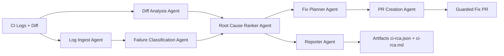

# ci-rootcause

Deterministic multi-agent CI root-cause analysis engine for failed CI runs.

## Purpose

`ci-rootcause` analyzes CI failures and produces:

- Structured failure graph
- Deterministic root-cause ranking
- Deterministic confidence score
- Evidence-backed fix plan
- Deterministic patch plan operations (`modify/create/delete/rename`)
- Optional guarded fix PR (never auto-merged)
- `ci-rca.json` and `ci-rca.md` artifacts

Primary runtime target is GitHub Actions.

## Architecture Overview



## Local Setup

Requirements:

- Python 3.11+

Install tools:

```bash
python -m pip install --upgrade pip
pip install -r requirements.txt
pre-commit install
```

Run checks:

```bash
ruff check .
ruff format --check .
pytest
```

## Quickstart

1. Install dependencies:

```bash
pip install -r requirements.txt
```

2. Run the local pipeline once:

```bash
ci-rootcause \
  --log-path fixtures/ci-logs/github-actions-python-failure.log \
  --diff-path fixtures/diffs/refactor-only.diff \
  --output-dir artifacts \
  --timestamp 2026-02-21T00:00:00Z \
  --commit abc123 \
  --run-id gha_quickstart_1 \
  --base-commit abc122 \
  --head-commit abc123 \
  --repository owner/repo
```

3. Inspect generated artifacts:
- `artifacts/ci-rca.json`
- `artifacts/ci-rca.md`

## Local CLI Execution

Run end-to-end deterministic analysis locally:

```bash
ci-rootcause \
  --log-path fixtures/ci-logs/github-actions-python-failure.log \
  --diff-path fixtures/diffs/refactor-only.diff \
  --historical-runs-path fixtures/classification/historical-runs.sample.json \
  --output-dir artifacts \
  --timestamp 2026-02-20T00:00:00Z \
  --commit abc123 \
  --run-id gha_local_1 \
  --base-commit abc122 \
  --head-commit abc123 \
  --repository owner/repo
```

CLI behavior:

- Writes `ci-rca.json` and `ci-rca.md` into `--output-dir`
- Prints a machine-readable JSON summary to stdout
- Exits `0` for `completed`/`partial` analysis runs, `2` for runtime/input errors
- Supports optional deterministic flaky-test detection via `--historical-runs-path`

Runtime mode:

- Uses Google ADK runtime orchestration by default when `google-adk` is installed
- Falls back to deterministic local orchestration if ADK runtime initialization fails
- Uses deterministic local orchestration when `--fail-fast` is enabled

## GitHub Action Interface

The action is defined in `action.yml`.

Inputs:

- `github_token` (required)
- `create_fix_pr` (default `false`)
- `post_pr_comment` (default `true`)
- `base_ref`, `head_ref`
- `config_path` (default `.ci-rootcause.yml`)
- `max_fix_files` (default `5`)
- `min_pr_confidence` (default `0.75`)

Outputs:

- `classification`, `confidence`, `primary_root_cause_title`
- `rca_json_path`, `rca_md_path`
- `pr_created`, `pr_url`, `pr_number`

Required workflow permissions:

- `contents: write` (PR creation only)
- `pull-requests: write`
- `actions: read`

## Architecture Details

Execution order is deterministic and fixed:

1. `log_ingest`
2. `diff_analysis`
3. `failure_classification`
4. `root_cause_ranker`
5. `fix_planner`
6. `reporter`
7. `pr_creation`

Runtime behavior:

- ADK runtime is used by default when available.
- Deterministic local fallback executes on ADK initialization/runtime failure.
- `fail_fast` uses deterministic local orchestration to preserve exception behavior.

## MVP Metrics And Release Artifacts

- Benchmark report JSON: `docs/reports/mvp-benchmark-report.json`
- Benchmark report summary: `docs/reports/mvp-benchmark-report.md`
- Release notes: `docs/release-notes-v0.1.0.md`
- Known limitations: `docs/limitations.md`

## Known Limitations And Non-Goals

- Current curated benchmark corpus is intentionally small (MVP scope).
- Classification coverage is deterministic-rule based and pattern limited.
- Timing metrics are runtime-derived and marked as nondeterministic metadata.
- Automated fix generation is guardrailed and intentionally conservative.
- No automatic merge or branch-protection bypass is supported.
- No CI rerun orchestration is included in MVP.

## Contributing

Contribution standards are documented in `CONTRIBUTING.md`.
