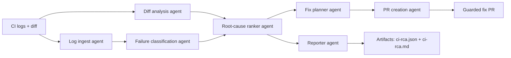

# ci-rootcause

Deterministic multi-agent CI root-cause analysis. Not a log summarizer.


> Read the technical write-up:  
> **[CI Failures Are Not Text Problems. They Are Execution Problems.](https://medium.com/p/e8ab5db074cd?postPublishedType=initial)**

## Why This Exists

Most AI CI tools summarize logs. That is not enough.

CI failures are execution-system failures: one early failure can create dozens of downstream symptoms, and the useful answer is the first evidence-backed root cause, not a plausible paragraph about the log.

`ci-rootcause` treats CI as a deterministic debugging problem:

- reconstruct the failure structure from logs and CI metadata,
- compare the failing run against the code diff,
- identify the first failure point,
- rank root causes with deterministic confidence,
- produce reproducible artifacts,
- optionally create a guarded fix PR that must pass validation.

## What It Does

Primary path: install the GitHub App, receive RCA comments on failed `workflow_run` events, and optionally allow guarded fix PRs.

Core outputs:

- Structured failure graph
- Deterministic failure classification
- Diff-aware root-cause ranking
- Deterministic confidence score
- Evidence-backed suggested fix
- Optional agentic fix proposal with deterministic validation
- Optional guarded fix PR, never auto-merged
- `ci-rca.json` and `ci-rca.md` artifacts
- `ci-rca-observability.json` telemetry with trace, timing, and reason-code data

Supported failure classes in the current benchmark: `TYPECHECK`, `LINT`, `TEST`, `DEPENDENCY`, and `INFRA`.

## Proven Results

Curated MVP benchmark (`13` cases):

| Metric | Result |
| --- | ---: |
| Classification accuracy | `100%` (`13/13`) |
| Baseline classification accuracy | `69.23%` (`9/13`) |
| Classification lift | `+30.77` percentage points, about `44.4%` relative lift |
| Top-1 root-cause accuracy | `100%` (`12/12` applicable cases) |
| Agentic proposal validity | `100%` (`6/6` exercised cases) |
| Guarded validation gate | `50%` (`3/6`, three valid fixes passed and three bad fixes were blocked) |
| Artifact hash reproducibility | `100%` |
| Confidence reproducibility | `100%` |

Validated coverage so far:

- Automated test suite: `299` tests passing, `1` opt-in live GitHub test skipped by default.
- Benchmark failure classes: `TYPECHECK`, `LINT`, `TEST`, `DEPENDENCY`, and `INFRA`.
- Agentic benchmark coverage: `6` proposal cases across lint, test, and typecheck fixes.
- Guardrails: safe default comment-only mode, PR opt-in gate, confidence threshold, scoped file changes, validation pass/fail, missing hosted API key, malformed proposal retry, low-signal comment suppression, and formatted fix commits.
- Live GitHub App smoke coverage: real `workflow_run` webhooks, PR comment create/update, typecheck/dependency/infra failures, local/Ollama suggestions, validation-failed PR gate, async webhook acknowledgement for slow local models, and app-created fix PRs that pass repository CI.

Reports:

- [`docs/reports/mvp-benchmark-report.md`](docs/reports/mvp-benchmark-report.md)
- [`docs/reports/mvp-benchmark-report.json`](docs/reports/mvp-benchmark-report.json)
- [`docs/reports/ollama-comparison.md`](docs/reports/ollama-comparison.md)
- [`docs/limitations.md`](docs/limitations.md)
- [`CHANGELOG.md`](CHANGELOG.md)

## Example Output

`ci-rca.json` is designed for automation and reproducible comparison:

```json
{
  "classification": "TYPECHECK",
  "confidence": 0.9,
  "primary_root_cause": {
    "title": "Argument 1 to needs_int has incompatible type str; expected int",
    "file": "app_failure_typecheck.py",
    "line": 5,
    "evidence": [
      "mypy reported an incompatible argument type",
      "the failing file changed in the PR diff",
      "the failure is the first reported error in the job"
    ]
  },
  "suggested_fix": "Change the string argument to an integer and run the typecheck validation command."
}
```

`ci-rca.md` is designed for humans:

- First failure: `app_failure_typecheck.py:5`
- Root cause: string passed where an integer is required
- Suggested fix: replace `needs_int("7")` with `needs_int(7)`
- Guardrail: create a fix PR only when confidence and validation pass

## What Makes This Different

- Deterministic confidence scoring, not LLM-generated confidence.
- Diff-aware analysis, so changed files influence ranking.
- Reproducible output artifacts for regression testing and audits.
- Structured failure graph reconstruction instead of raw log summarization.
- Machine-readable reason codes for skipped, partial, and failed app outcomes.
- Guarded PR creation with confidence, file-scope, and validation gates.
- Provider-optional agentic mode: deterministic by default, local/Ollama or hosted LLMs when explicitly enabled.

## App-First Quickstart

Recommended path for new users: install the GitHub App. No workflow YAML is required in target repositories.

1. Install the GitHub App on the target repository.
2. Start with safe defaults:
   - `CI_ROOTCAUSE_APP_ENABLED=true`
   - `CI_ROOTCAUSE_APP_POST_COMMENT=true`
   - `CI_ROOTCAUSE_APP_ENABLE_PR_MODE=false`
   - `CI_ROOTCAUSE_APP_CREATE_FIX_PR=false`
3. Trigger a failed `workflow_run`.
4. Verify the PR or commit receives an RCA comment with:
   - classification,
   - confidence,
   - first-failure evidence,
   - suggested fix,
   - artifact paths,
   - outcome reason codes.
5. Enable fix PR creation only after comment-only behavior is trusted:
   - `CI_ROOTCAUSE_APP_ENABLE_PR_MODE=true`
   - `CI_ROOTCAUSE_APP_CREATE_FIX_PR=true`
   - `CI_ROOTCAUSE_APP_MIN_PR_CONFIDENCE=0.75`

Setup references:

- [`docs/app-first-mvp.md`](docs/app-first-mvp.md)
- [`docs/app-config-contract.md`](docs/app-config-contract.md)
- [`docs/app-outcome-codes.md`](docs/app-outcome-codes.md)
- [`docs/app-operations.md`](docs/app-operations.md)
- [`docs/migration-action-to-app.md`](docs/migration-action-to-app.md)

## Optional GitHub Action Usage

The GitHub App is the primary product path. The composite action remains available for workflow-based users and migration support.

```yaml
- uses: ibrahim1023/ci-rootcause-action@v0
  with:
    github_token: ${{ secrets.GITHUB_TOKEN }}
    post_pr_comment: true
    create_fix_pr: false
    max_fix_files: 5
```

Useful optional inputs:

- `mode`: `deterministic`, `agentic_assist`, or `agentic_full`
- `provider`: `local`, `openai`, `gemini`, or `anthropic`
- `provider_api_key`: required for hosted providers in agentic modes
- `validation_commands`: semicolon or newline separated validation commands
- `min_pr_confidence`: minimum confidence before guarded PR creation
- `offline_only`: skip remote PR creation/network calls

## Agentic Modes

Recommended default for new users: `deterministic`.

| Mode | Autonomy | Key requirement | Cost profile | Risk profile |
| --- | --- | --- | --- | --- |
| `deterministic` | Rule-based diagnosis and fix planning | None | Lowest | Lowest |
| `agentic_assist` | LLM proposes candidate fix steps; deterministic pipeline validates or falls back | Hosted providers require API key; `local` does not | Medium | Low-medium |
| `agentic_full` | Highest autonomy path with explicit opt-in gate | Hosted providers require API key; `local` does not | Highest | Highest |

Provider support:

- Hosted: `openai`, `gemini`, `anthropic`.
- Local: `local` for Ollama-compatible endpoints.
- Recommended local default: `qwen2.5-coder:3b`.
- Use `qwen2.5-coder:7b` when local hardware can tolerate slower responses.

GitHub App examples:

```bash
export CI_ROOTCAUSE_APP_MODE=agentic_assist
export CI_ROOTCAUSE_APP_LLM_PROVIDER=local
export CI_ROOTCAUSE_APP_LLM_MODEL=qwen2.5-coder:3b
export CI_ROOTCAUSE_APP_LLM_BASE_URL=http://localhost:11434
```

```bash
export CI_ROOTCAUSE_APP_MODE=agentic_assist
export CI_ROOTCAUSE_APP_LLM_PROVIDER=openai
export CI_ROOTCAUSE_APP_LLM_API_KEY=<secret>
```

## Evaluation

We evaluate correctness and safety, not just plausibility.

Current gates include:

- classification match rate,
- primary root-cause accuracy,
- top-1 root-cause accuracy,
- confidence reproducibility,
- artifact hash reproducibility,
- agentic proposal schema validity,
- validation gate behavior,
- app reason-code stability.

Run the benchmark locally:

```bash
python scripts/run_benchmark.py \
  --suite fixtures/benchmarks/mvp-suite.json \
  --output-root artifacts/benchmark-mvp \
  --report-json docs/reports/mvp-benchmark-report.json \
  --report-md docs/reports/mvp-benchmark-report.md
```

Compare local Ollama models:

```bash
python scripts/run_ollama_comparison.py \
  --suite fixtures/benchmarks/mvp-suite.json \
  --llm-model qwen2.5-coder:3b \
  --report-json artifacts/ollama-comparison/qwen2.5-coder-3b.json
```

## Who This Is For

- Developers debugging failed CI runs.
- Teams dealing with noisy or flaky pipelines.
- AI infra teams building reliable automation.
- Engineering teams that need explainable, repeatable CI debugging.
- Maintainers who want suggested fixes without unsafe auto-merges.

## Architecture Overview



Execution order is deterministic and fixed:

1. `log_ingest`
2. `diff_analysis`
3. `failure_classification`
4. `root_cause_ranker`
5. `fix_planner`
6. `reporter`
7. `pr_creation`

Runtime behavior:

- Uses Google ADK runtime orchestration when `google-adk` is installed.
- Falls back to deterministic local orchestration if ADK runtime initialization fails.
- Uses deterministic local orchestration when `--fail-fast` is enabled.

## Design Constraints

- No LLM-based confidence scoring.
- No hallucinated root causes without log or diff evidence.
- Fixes must be evidence-backed and scoped.
- PR creation is opt-in and guarded.
- No auto-merge.
- No branch-protection bypass.
- No repo-wide autonomous refactors.
- Deterministic output is preferred over clever but unstable behavior.

## Vision

CI debugging should be deterministic, explainable, and reproducible.

The goal is not to replace CI, linters, typecheckers, or test suites. The goal is to connect failed execution evidence to the smallest useful diagnosis and, when explicitly enabled, a reviewable fix PR.

## Local Setup

Requirements:

- Python 3.11+

Install tools:

```bash
python -m pip install --upgrade pip
pip install -r requirements.txt
pre-commit install
```

Run checks:

```bash
ruff check .
ruff format --check .
pytest
```

## CLI Quickstart

Run the local deterministic pipeline once:

```bash
ci-rootcause \
  --log-path fixtures/ci-logs/github-actions-python-failure.log \
  --diff-path fixtures/diffs/refactor-only.diff \
  --output-dir artifacts \
  --timestamp 2026-02-21T00:00:00Z \
  --commit abc123 \
  --run-id gha_quickstart_1 \
  --base-commit abc122 \
  --head-commit abc123 \
  --repository owner/repo
```

Inspect generated artifacts:

- `artifacts/ci-rca.json`
- `artifacts/ci-rca.md`

CLI behavior:

- Writes `ci-rca.json` and `ci-rca.md` into `--output-dir`.
- Prints a machine-readable JSON summary to stdout.
- Exits `0` for `completed`/`partial` analysis runs, `2` for runtime/input errors.
- Supports optional deterministic flaky-test detection via `--historical-runs-path`.
- Supports local `--config-path` and single-stream stdin input via `-`.
- Supports `--offline-only` to force no remote PR creation/network calls.
- Supports rollout profile `--profile safe-github-rollout`.

## Demo Fixtures

Run three reproducible demo scenarios:

```bash
for case in \
  fixtures/demos/01-dependency-lockfile-drift \
  fixtures/demos/02-typecheck-ts2345 \
  fixtures/demos/03-infra-timeout
do
  name="$(basename "$case")"
  ci-rootcause \
    --log-path "$case/ci.log" \
    --diff-path "$case/change.diff" \
    --output-dir "artifacts/demo/$name" \
    --timestamp 2026-02-21T00:00:00Z \
    --commit abc123 \
    --run-id "demo_${name}" \
    --base-commit abc122 \
    --head-commit abc123 \
    --repository owner/repo
done
```

Demo fixture pack:

- [`fixtures/demos/README.md`](fixtures/demos/README.md)
- `fixtures/demos/01-dependency-lockfile-drift`
- `fixtures/demos/02-typecheck-ts2345`
- `fixtures/demos/03-infra-timeout`

## Live GitHub Integration Test

Live PR creation/idempotency validation is available as an opt-in integration test:

```bash
scripts/run_live_github_test.sh \
  --repo-path /path/to/disposable/repo \
  --repository owner/repo \
  --token ghp_xxx \
  --target-branch main
```

Notes:

- Test is skipped unless `CI_ROOTCAUSE_LIVE_GITHUB=1`.
- Use a disposable repository with push and PR permissions.
- Script prints a cleanup checklist after the test run.

## Current Limits

- Current benchmark coverage is curated and intentionally small.
- Classification is deterministic-pattern based and may miss unseen signatures.
- Fix generation is intentionally conservative and validation-gated.
- App mode currently targets GitHub Actions `workflow_run` events.
- CI rerun orchestration is not included.
- Automatic merge and branch-protection bypass are not supported.

## Roadmap

- Expand the curated CI failure dataset.
- Add deeper language-specific analyzers.
- Improve dependency drift and lockfile diagnostics.
- Add stronger diff-to-failure linking for multi-file changes.
- Add staging/deployment packaging for the GitHub App service.
- Expand CI provider support beyond GitHub Actions.

## Contributing

Contribution standards are documented in [`CONTRIBUTING.md`](CONTRIBUTING.md).
